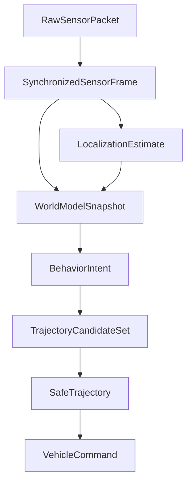

# Veri Akışı

```mermaid
flowchart TD
  Raw[RawSensorPacket] --> Sync[SynchronizedSensorFrame]
  Sync --> Loc[LocalizationEstimate]
  Sync --> World[WorldModelSnapshot]
  Loc --> World
  World --> Intent[BehaviorIntent]
  Intent --> Candidate[TrajectoryCandidateSet]
  Candidate --> Safe[SafeTrajectory]
  Safe --> Command[VehicleCommand]
```

Her mesaj `MessageMetadata` ile timestamp, simulation frame, sequence, coordinate frame, source module ve configuration hash taşır.
