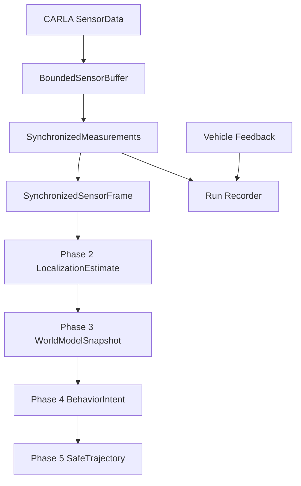

# Veri Akışı

Callback payload'ı gateway içinde kopyalanmadan runtime nesnesi olarak tutulur. `RawSensorPacket` Faz 1'de metadata görünümüdür; gerçek payload sonraki işlem için `SynchronizedMeasurements.measurements_by_sensor_id` içindedir. Her ortak frame configuration hash, CARLA frame ve timestamp ile kaydedilir.
