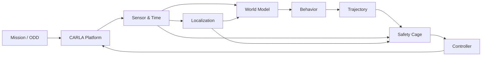

# Sistem Mimarisi

??? info "Faz 0'da uygulananlar"
    Configuration, contracts, runtime lifecycle, CARLA bağlantı adaptörü ve launcher.

??? warning "Henüz uygulanmayanlar"
    Sensör aktörleri, lokalizasyon, world model, planning, safety ve control yalnızca plan/registry seviyesindedir.
