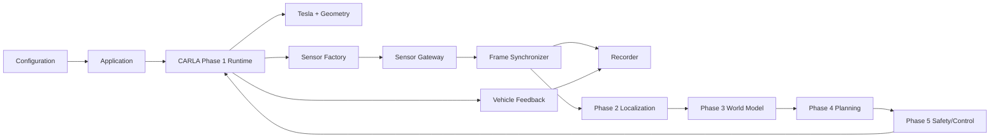

# Sistem Mimarisi

??? success "Faz 1'de uygulananlar"
    Araç geometrisi, Tesla spawn, 16 sensor actor, synchronous tick, bounded buffer, exact-frame sync, vehicle feedback, recorder ve cleanup.

??? warning "Henüz uygulanmayanlar"
    Localization, world model, behavior/trajectory planning, Safety Cage ve controller.
