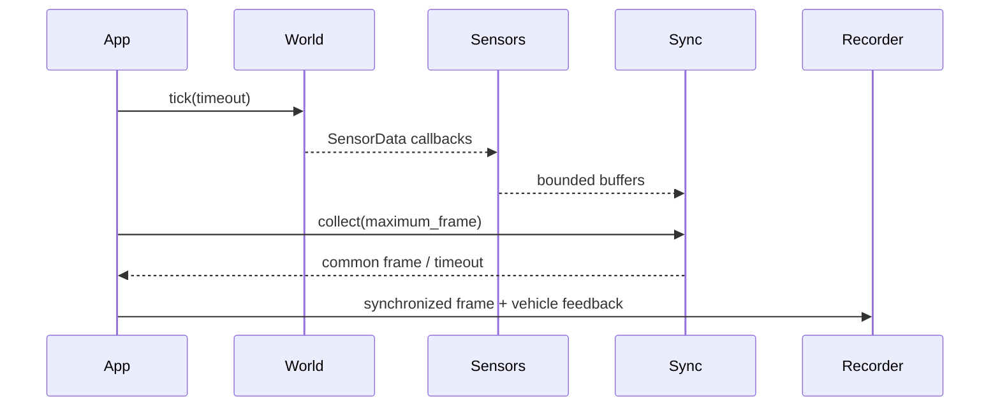

# Faz 1 Runtime

## Başlatma sırası

1. CARLA client/server sürümü doğrulanır.
2. Orijinal world settings saklanır.
3. Synchronous mode ve 0.02 s fixed delta uygulanır.
4. Tesla Model 3 ilk uygun spawn noktasında oluşturulur.
5. Araç autopilot'tan çıkarılır ve tam fren/el freni uygulanır.
6. Bounding box ve wheel physics üzerinden geometri çıkarılır.
7. 16 sensör rigid attachment ile oluşturulur.
8. Recorder manifesti açılır.
9. Application tek world tick sahibi olur.

## Tick sırası

25 Hz sensörlerle 50 Hz sensörlerin ortak stride değeri konfigürasyondan hesaplanır. İlk ortak frame'in parity'si sabit varsayılmaz.

## Cleanup invariantları

- Callback actor'ları önce stop/destroy edilir.
- Ego actor destroy edilir.
- Recorder final durumu yazılır.
- Önceki world settings geri yüklenir.
- Kısmi start hatalarında aynı cleanup yolu idempotent olarak çalışır.

## Kayıt şeması

`manifest.json`, configuration hash, CARLA sürümleri, harita, vehicle geometry, sensor pose/attributes ve durum taşır. `frames.jsonl`, ortak frame metadata'sı ve araç geri bildirimini satır bazlı kaydeder.
